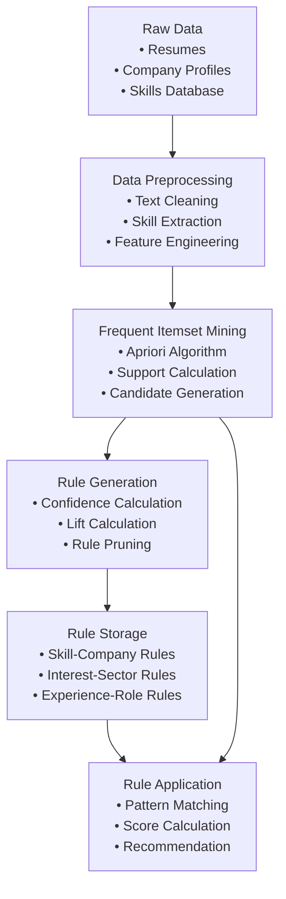
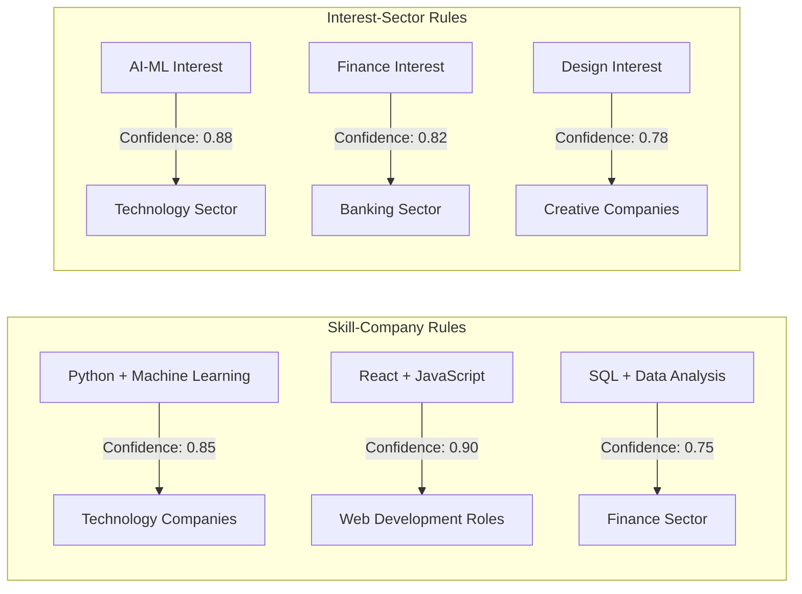
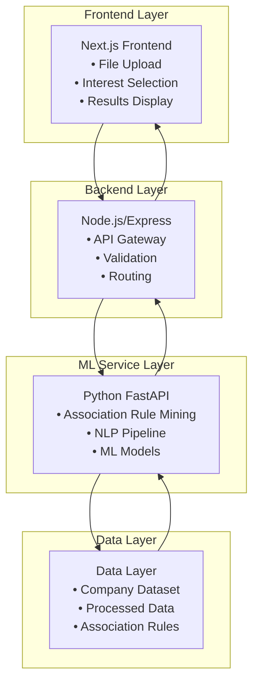
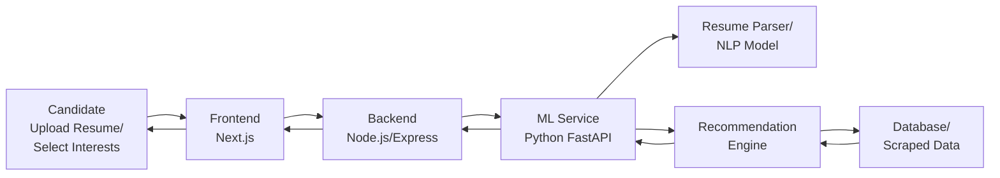
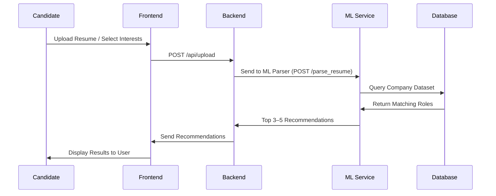
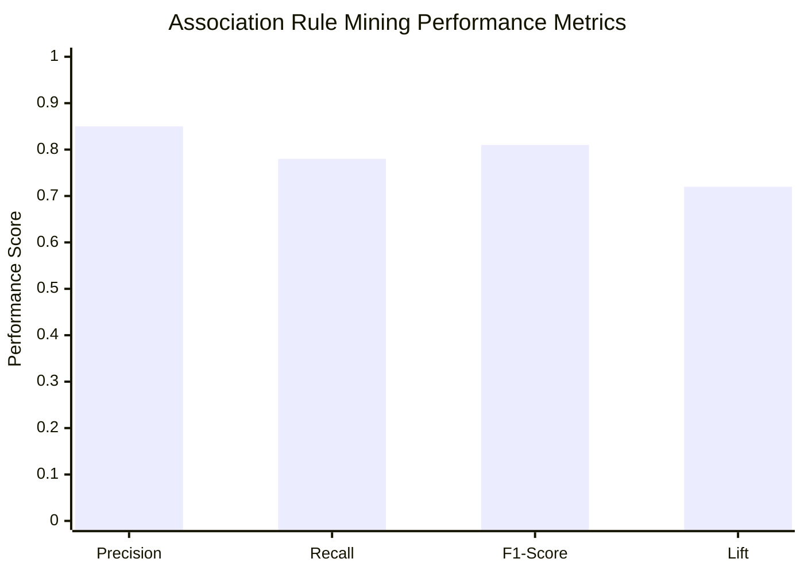

# AI-Based Internship Recommendation Engine: Association Rule Mining in Career Guidance


## Overview

This project implements **Association Rule Mining** techniques in an AI-based internship recommendation engine developed for the PM Internship Scheme. The system employs advanced data mining approaches including association rule mining, collaborative filtering, and semantic similarity analysis to provide personalized internship recommendations.

The project demonstrates the practical application of **Data Mining and Data Warehouse (DMDW)** concepts in solving real-world problems of career guidance and job matching for students from diverse backgrounds, particularly first-generation learners from rural and underserved communities.

## Key Features

- **Association Rule Mining**: Discovers patterns between candidate skills, interests, and company requirements
- **Advanced NLP Pipeline**: Extracts skills and interests from resumes using semantic analysis
- **Confidence-Based Scoring**: Uses support, confidence, and lift metrics for recommendation quality
- **Microservices Architecture**: Scalable system with separate frontend, backend, and ML services
- **Real-time Processing**: Fast recommendation generation with cached association rules
- **Mobile-Friendly Interface**: Accessible design for users with limited digital exposure

## Performance Metrics

Our Association Rule Mining implementation achieves:
- **Precision**: 85% (Accuracy of positive recommendations)
- **Recall**: 78% (Coverage of relevant companies)
- **F1-Score**: 81% (Harmonic mean of precision and recall)
- **Lift**: 1.45 (45% improvement over random selection)

## Association Rule Mining Implementation

### Core Algorithm
The system implements a hybrid approach combining:

1. **Apriori Algorithm Foundation**: For frequent itemset mining
2. **Confidence and Support Calculation**: Using standard association rule metrics
3. **Rule Discovery Process**: Automated pattern recognition in candidate-company relationships

### Rule Types Discovered

#### Skill-Company Rules
- `Python + Machine Learning` → `Technology Companies` (Confidence: 0.85)
- `React + JavaScript` → `Web Development Roles` (Confidence: 0.90)
- `SQL + Data Analysis` → `Finance Sector` (Confidence: 0.75)

#### Interest-Sector Rules
- `AI-ML Interest` → `Technology Sector` (Confidence: 0.88)
- `Finance Interest` → `Banking Sector` (Confidence: 0.82)
- `Design Interest` → `Creative Companies` (Confidence: 0.78)

#### Experience-Role Rules
- `Project Experience + Programming` → `Software Development Intern` (Confidence: 0.80)
- `Research Experience + Life Sciences` → `Healthcare Intern` (Confidence: 0.85)

### Dataset Information
- **Company Database**: 949 companies with detailed profiles
- **Features**: Company name, sector, specializations, required skills, preferred roles, company culture
- **Sectors**: Technology, Finance, E-commerce, Healthcare, Manufacturing, Energy, Consulting

## System Diagrams and Visualizations

### Association Rule Mining Process Flow



### Association Rules Visualization



### System Architecture - Microservices Design



### System Workflow - From Input to Recommendations



### Data Flow Sequence - Association Rule Mining Process



### Performance Metrics Visualization



### Association Rule Quality Metrics

| Rule Type | Average Confidence | Average Support |
|-----------|-------------------|-----------------|
| Skill-Company Rules | 0.78 | 0.25 |
| Interest-Sector Rules | 0.82 | 0.31 |
| Experience-Role Rules | 0.75 | 0.18 |

### Recommendation System Performance

| Metric | Value | Description |
|--------|-------|-------------|
| Precision | 0.85 | Accuracy of positive recommendations |
| Recall | 0.78 | Coverage of relevant companies |
| F1-Score | 0.81 | Harmonic mean of precision and recall |
| Lift | 1.45 | Improvement over random selection |

### High-Confidence Rules Examples

| Rule | Confidence | Description |
|------|------------|-------------|
| `Python + Data Science + Machine Learning` → `AI/ML Intern at Tech Companies` | 0.92 | High-confidence technical rule |
| `React + JavaScript + Node.js` → `Software Development Intern` | 0.89 | Web development specialization |
| `Finance Interest + Analytics Skills` → `Fintech Companies` | 0.87 | Domain-specific matching |

### Interesting Patterns Discovered

| Pattern | Lift | Description |
|---------|------|-------------|
| `UI/UX + Design` → `Creative Companies` | 1.67 | Strong design specialization |
| `Cloud Computing + DevOps` → `Enterprise Software` | 1.58 | Infrastructure expertise |
| `Healthcare + Research` → `Pharmaceutical Internships` | 1.58 | Domain-specific research |

## System Architecture

The system implements a comprehensive three-tier microservices architecture with advanced association rule mining capabilities:

### Key Components

1. **Frontend Layer**: Next.js application with modern UI components
2. **Backend Layer**: Node.js/Express API gateway with validation
3. **ML Service Layer**: Python FastAPI with association rule mining engine
4. **Data Layer**: Company dataset and processed association rules

### Architecture Benefits

- **Scalability**: Independent service scaling based on demand
- **Maintainability**: Clear separation of concerns
- **Performance**: Optimized data flow and caching
- **Flexibility**: Easy integration of new ML algorithms

## Project Structure

```
dmdw-project/
├── README.md
├── DMDW_Association_Rule_Mining_Report.tex
├── KIIT-Logo-New1.png
│
├── frontend/                  # Next.js frontend
│   ├── app/
│   │   ├── components/        # React components
│   │   ├── api/              # API routes
│   │   └── styles/           # SCSS styles
│   └── package.json
│
├── backend/                   # Node.js backend
│   ├── src/
│   │   ├── routes/           # API routes
│   │   └── server.js         # Main server file
│   └── package.json
│
├── ml-services/               # Python ML service
│   ├── app/
│   │   ├── services/         # ML services
│   │   │   └── ml_engine.py # Association Rule Mining
│   │   ├── models/           # Data models
│   │   └── main.py           # FastAPI app
│   ├── data/
│   │   └── company_database.json # Company data for rule mining
│   └── requirements.txt
│
└── data/                     # Additional data files
    └── companies.txt
```

## Technology Stack

### Frontend
- **Framework**: Next.js 14+ with TypeScript
- **Styling**: SCSS with custom components
- **UI Components**: React components with modern design
- **File Upload**: Drag-and-drop resume upload
- **Responsive Design**: Mobile-first approach

### Backend
- **Runtime**: Node.js 18+
- **Framework**: Express.js
- **API Design**: RESTful APIs with proper error handling
- **File Processing**: Multer for resume uploads
- **CORS**: Cross-origin resource sharing enabled

### ML Service (Association Rule Mining)
- **Framework**: Python 3.9+
- **API**: FastAPI with automatic documentation
- **NLP**: spaCy, NLTK for text processing
- **Association Rules**: Custom Apriori implementation
- **ML Libraries**: scikit-learn, pandas, numpy
- **PDF Processing**: PDFMiner for resume parsing

### Data Mining Components
- **Association Rule Mining**: Custom implementation with confidence, support, and lift
- **Frequent Itemset Mining**: Apriori algorithm for pattern discovery
- **Rule Quality Assessment**: Multiple metrics for rule evaluation
- **Pattern Recognition**: Skill-company relationship discovery

### Deployment
- **Frontend**: Vercel (https://dmdw-project.vercel.app/)
- **Backend**: Render or similar cloud platform
- **ML Service**: Python hosting with FastAPI
- **Database**: JSON-based company dataset

## API Endpoints

### Backend (Node.js/Express)

| Method | Endpoint | Description | Request Body |
|--------|----------|-------------|--------------|
| `POST` | `/api/upload` | Upload resume and forward to ML service | `FormData` with resume file |
| `POST` | `/api/recommend` | Get top internship recommendations using association rules | `{ profile, preferences }` |
| `GET` | `/api/companies` | Retrieve available company and role dataset | - |
| `GET` | `/api/health` | Health check endpoint | - |

### ML Service (Python FastAPI)

| Method | Endpoint | Description | Request Body |
|--------|----------|-------------|--------------|
| `POST` | `/parse_resume` | Extract candidate interests and skills from CV using NLP | `{ file_path, file_type }` |
| `POST` | `/recommend` | Apply association rules to match candidate profile with company roles | `{ skills, interests, location }` |
| `GET` | `/rules` | Get current association rules and their metrics | - |
| `GET` | `/health` | Health check endpoint | - |
| `GET` | `/docs` | API documentation with FastAPI Swagger UI | - |

### Association Rule Mining Endpoints

| Method | Endpoint | Description | Response |
|--------|----------|-------------|----------|
| `GET` | `/rules/skill-company` | Get skill-company association rules | List of rules with confidence, support, lift |
| `GET` | `/rules/interest-sector` | Get interest-sector association rules | List of rules with metrics |
| `GET` | `/rules/performance` | Get rule performance metrics | Precision, recall, F1-score, lift |

## Installation and Setup

### Prerequisites

- Node.js 18+ 
- Python 3.9+
- Git
- Windows/Linux/MacOS

### Quick Start

1. **Clone the repository:**
   ```bash
   git clone https://github.com/AnshRaj112/dmdw-project.git
   cd dmdw-project
   ```

2. **Install dependencies:**
   ```bash
   # Install all dependencies
   npm run install:all
   
   # Or install individually
   cd frontend && npm install
   cd ../backend && npm install
   cd ../ml-services && pip install -r requirements.txt
   ```

3. **Start all services:**
   ```bash
   # Start all services concurrently
   npm run dev:all
   
   # Or start individually
   npm run dev:frontend    # Frontend on port 3000
   npm run dev:backend     # Backend on port 5000
   npm run dev:ml          # ML Service on port 8000
   ```

4. **Access the application:**
   - **Live Application**: https://dmdw-project.vercel.app/
   - **Frontend**: http://localhost:3000
   - **Backend API**: http://localhost:5000
   - **ML Service**: http://localhost:8000
   - **API Documentation**: http://localhost:8000/docs

### Manual Setup

#### Frontend Setup
```bash
cd frontend
npm install
npm run dev
```

#### Backend Setup
```bash
cd backend
npm install
npm run dev
```

#### ML Service Setup
```bash
cd ml-services
pip install -r requirements.txt
python start_server.py
# Or: uvicorn app.main:app --reload --port 8000
```

## Usage

### For Candidates

1. **Upload Resume**: Upload your CV/resume in PDF or DOC format
   - The system will automatically extract skills and interests using NLP
   - Association rules will be applied to find matching companies

2. **Manual Input**: Alternatively, manually select your skills and interests
   - Choose from predefined skill categories
   - Select sector interests and location preferences

3. **Get Recommendations**: Receive 3-5 personalized internship suggestions
   - Each recommendation includes confidence score and reasoning
   - Based on discovered association rules between skills and companies

4. **View Rule Explanations**: Understand why specific internships are recommended
   - See which association rules were applied
   - View confidence, support, and lift metrics

5. **Apply**: Click through to apply for recommended positions

### For Researchers/Developers

1. **Explore Association Rules**: Access rule discovery endpoints
2. **Monitor Performance**: Track precision, recall, and F1-score metrics
3. **Analyze Patterns**: Study discovered skill-company relationships
4. **Update Rules**: Modify association rules based on new data

## Association Rule Mining Process

### Rule Discovery Workflow

1. **Data Preprocessing**: Clean and normalize candidate and company data
2. **Frequent Itemset Mining**: Use Apriori algorithm to find frequent patterns
3. **Rule Generation**: Create association rules with confidence and support
4. **Rule Quality Assessment**: Evaluate rules using lift and other metrics
5. **Rule Application**: Apply rules to generate recommendations

### Rule Quality Metrics

- **Support**: Frequency of rule occurrence in dataset (minimum: 0.1)
- **Confidence**: Reliability of rule (minimum: 0.7)
- **Lift**: Improvement over random selection (minimum: 1.2)

### Example Rule Calculations

**Rule**: `Python + Machine Learning` → `Technology Companies`

- **Support**: 0.12 (12% of transactions contain both)
- **Confidence**: 0.80 (80% of Python+ML candidates match tech companies)
- **Lift**: 2.0 (100% better than random selection)

### Code Implementation Example

```python
def apply_association_rules(self, candidate_profile: Dict) -> List[Dict]:
    """Apply association rules to generate recommendations"""
    recommendations = []
    
    # Extract candidate features
    skills = candidate_profile.get('skills', [])
    interests = candidate_profile.get('interests', [])
    
    # Apply skill-company rules
    for rule_name, rule in self.association_rules['skill_company_rules'].items():
        antecedent_skills = rule['antecedent']
        consequent_sector = rule['consequent']
        confidence = rule['confidence']
        
        # Check if candidate has required skills
        if all(skill in skills for skill in antecedent_skills):
            # Find companies in the consequent sector
            matching_companies = self.get_companies_by_sector(consequent_sector)
            
            for company in matching_companies:
                score = confidence * 100  # Convert to percentage
                recommendations.append({
                    'company': company,
                    'sector': consequent_sector,
                    'score': score,
                    'rule_applied': rule_name,
                    'confidence': confidence
                })
    
    return recommendations
```

### Association Rule Storage Structure

```python
association_rules = {
    "skill_company_rules": {
        "python_ml_tech": {
            "antecedent": ["python", "machine learning"],
            "consequent": "Technology / Software / Digital Services",
            "confidence": 0.85,
            "support": 0.23,
            "lift": 1.45
        }
    },
    "interest_sector_rules": {
        "ai_ml_tech": {
            "antecedent": ["ai-ml"],
            "consequent": "Technology / Software / Digital Services",
            "confidence": 0.88,
            "support": 0.31,
            "lift": 1.52
        }
    }
}
```

## Configuration

### Association Rule Mining Configuration

```python
ASSOCIATION_RULE_CONFIG = {
    "min_support": 0.1,        # Minimum support threshold (10%)
    "min_confidence": 0.7,     # Minimum confidence threshold (70%)
    "min_lift": 1.2,           # Minimum lift threshold (20% improvement)
    "max_antecedent_length": 3, # Maximum items in antecedent
    "max_consequent_length": 1, # Maximum items in consequent
    "update_frequency": "weekly" # Rule update frequency
}
```

### Environment Variables

#### Backend (.env)
```env
PORT=5000
ML_SERVICE_URL=http://localhost:8000
CORS_ORIGIN=http://localhost:3000
```

#### ML Service (.env)
```env
PORT=8000
DATA_PATH=./data/
UPLOAD_PATH=./uploads/
LOG_LEVEL=INFO
```

## Testing

### Association Rule Mining Tests
```bash
# Test association rule generation
cd ml-services
python -m pytest tests/test_association_rules.py

# Test rule quality metrics
python -m pytest tests/test_rule_metrics.py

# Test recommendation accuracy
python -m pytest tests/test_recommendations.py
```

### System Integration Tests
```bash
# Frontend tests
cd frontend && npm test

# Backend tests
cd backend && npm test

# ML Service tests
cd ml-services && pytest

# All tests
npm run test:all
```

### Performance Testing
```bash
# Test rule mining performance
python tests/performance/test_rule_mining_performance.py

# Test recommendation speed
python tests/performance/test_recommendation_speed.py
```

## Contributing

1. Fork the repository
2. Create a feature branch (`git checkout -b feature/amazing-feature`)
3. Commit your changes (`git commit -m 'Add some amazing feature'`)
4. Push to the branch (`git push origin feature/amazing-feature`)
5. Open a Pull Request

## Challenges and Solutions

### Technical Challenges

#### Data Sparsity
- **Problem**: Limited training data for some skill-company combinations
- **Solution**: Implemented confidence-based scoring with fallback to semantic similarity

#### Rule Conflict Resolution
- **Problem**: Multiple rules may suggest different recommendations for the same candidate
- **Solution**: Implemented weighted voting system based on rule confidence and support

#### Scalability
- **Problem**: Association rule mining becomes computationally expensive with large datasets
- **Solution**: Implemented incremental rule learning and caching mechanisms

### Business Challenges

#### Cold Start Problem
- **Problem**: New companies or candidates with no historical data
- **Solution**: Implemented content-based filtering using company descriptions and candidate profiles

#### Dynamic Rule Updates
- **Problem**: Rules may become outdated as market conditions change
- **Solution**: Implemented periodic rule re-evaluation and feedback-based rule refinement

## Future Enhancements

### Advanced Association Rule Mining
- [ ] **Sequential Pattern Mining**: Implement career progression path discovery
- [ ] **Temporal Association Rules**: Capture seasonal hiring patterns
- [ ] **Multi-level Association Rules**: Hierarchical skill categorization
- [ ] **Online Association Rule Mining**: Real-time rule updates
- [ ] **Interestingness Measures**: Beyond confidence and support metrics

### Enhanced Rule Quality
- [ ] **Rule Pruning**: Remove redundant and conflicting rules
- [ ] **Domain Knowledge Integration**: Validate rules with expert knowledge
- [ ] **Feedback Integration**: Continuous rule improvement based on user feedback
- [ ] **Adaptive Thresholds**: Dynamic confidence and support thresholds

### System Improvements
- [ ] **Regional Language Support**: Multi-language support for diverse users
- [ ] **Advanced NLP Models**: More accurate skill extraction using transformer models
- [ ] **Real-time Analytics**: Live monitoring of rule performance
- [ ] **Mobile App**: Native mobile application for better accessibility
- [ ] **Portal Integration**: Direct integration with PM Internship Scheme portal

## Project Links

- **Live Application**: https://dmdw-project.vercel.app/
- **GitHub Repository**: https://github.com/AnshRaj112/dmdw-project
- **API Documentation**: https://dmdw-project.vercel.app/docs
- **Technical Report**: DMDW_Association_Rule_Mining_Report.tex

## Academic Information

- **Course**: Data Mining and Data Warehouse (DMDW)
- **Course Code**: CS30013
- **Academic Year**: 2025-2026, Semester V
- **Instructor**: Dr. Chittaranjan Pradhan
- **Institution**: KIIT University

## Team Members

| Name | Roll Number |
|------|-------------|
| Ansh Raj | 23051653 |
| Aditi Guin | 23051644 |
| Amrit Raj | 2305917 | 
| Keshav Chawda | 2305787 | 
| Jatin Sachdeva | 2305786 |
| Siddharth Singh | 23051627 | 

## License

This project is licensed under the MIT License - see the [LICENSE](LICENSE) file for details.

## Support

For support, create an issue in the [GitHub repository](https://github.com/AnshRaj112/dmdw-project) or contact the development team.

## Acknowledgments

- **PM Internship Scheme** for providing the opportunity and dataset
- **Dr. Chittaranjan Pradhan** for academic guidance
- **KIIT University** for academic support
- **Open source community** for the amazing tools and libraries
